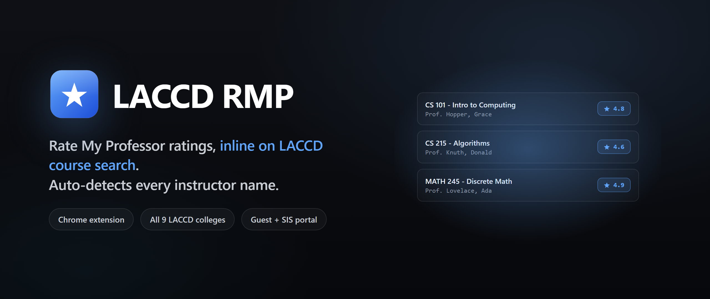

  

<h3 align="center">
  Rate My Professor ratings, inline on LACCD course search.
</h3>

  Auto-detects every instructor name on both Guest Search and the SIS Portal.

  Built with the <strong>LACCD Tech Club</strong>, led by <a href="https://github.com/RemielDev">@RemielDev</a> as Club President.

  
  

  
  
  

---

Shows Rate My Professor ratings next to instructor names on LACCD course search pages.

## Features

* Auto detects instructor names on both public and student portal pages
* Inline rating with link to RMP profile
* Supports all 9 LACCD colleges
* Works on both Guest Search and the authenticated SIS Portal

## Install

1. Download or clone this repo
2. Open `chrome://extensions/`
3. Enable developer mode
4. Click **Load unpacked** and select the folder with `manifest.json`

## Supported pages

**Public Guest Search:**
* `https://mycollege-guest.laccd.edu/psc/classsearchguest/EMPLOYEE/HRMS/c/COMMUNITY_ACCESS.CLASS_SEARCH.GBL`

**Student SIS Portal (requires login):**
* `https://csprd.laccd.edu/psc/csprd/EMPLOYEE/SA/c/SSR_STUDENT_FL.*` (View My Classes, Class Search, etc.)
* All class search and enrollment pages within the SIS portal

## How it works

* Content script finds names and injects rating buttons
* Queries RMP by name and campus
* Caches results for about 24 hours

## Troubleshooting

* If ratings do not appear, wait a few seconds or refresh

## Privacy

* No personal data collected
* Processing happens locally in your browser

## Credits

Built collaboratively with the **LACCD Tech Club** while [@RemielDev](https://github.com/RemielDev) served as Club President. Thanks to every Tech Club member who helped test against the nine campuses and the SIS Portal quirks.

## License and disclaimer

Open source for educational use. Not officially affiliated with LACCD or Rate My Professor.

## Flow

**Plugin flow**
1. Page loads → detects system (Guest Search or SIS Portal)
2. Script marks itself ready (`window.laccdRmpExtension = true`)
3. Waits 2-3s (longer for SIS due to complex page load)
4. Runs `processAllProfessors()`

**Finding professors**
- **Guest Search:** Looks for `span[id^="MTG_INSTR$"]` elements
- **SIS Portal:** Searches for:
  - `span[id*="INSTR"]` elements
  - `span[id*="SSR_CLS_DTL_WRK_INSTRNAME"]` elements
  - Expanded class detail sections
  - Elements near "Instructor" labels

**Processing flow**
`processAllProfessors()` → `findProfessorElements()` → for each professor:
1. Create RMP button showing "Loading..."
2. Insert button next to professor name
3. Determine campus (room column first, URL fallback)
4. Send message to background: `{action: 'searchProfessor', name, campus}`
5. Background replies with RMP search link
6. `updateRMPButton()` sets final label/link

**Keeping results fresh**
- **DOM Observer:** Watches for new content, throttled to once per second
- **Click Listeners:**
  - Guest Search: Detects search button clicks → waits 2/4/6s → reruns
  - SIS Portal: Detects class detail clicks or search → waits 1-4s → reruns
- **Interval Check:** Every 3s, checks for unprocessed instructor names

**Per-professor flow**
Professor span found → button starts as "⏳ Loading..." → message to background → response received → button becomes "🔍 Search RMP" link to RateMyProfessors search; on error → button shows "❓ Not Found"
